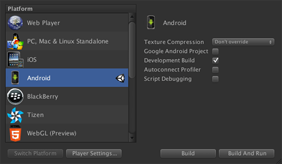
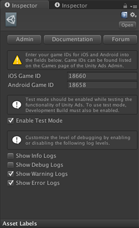
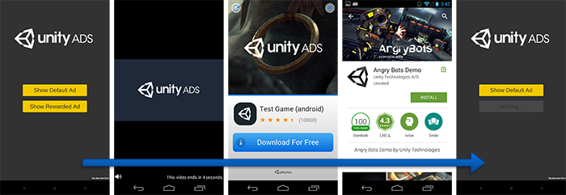
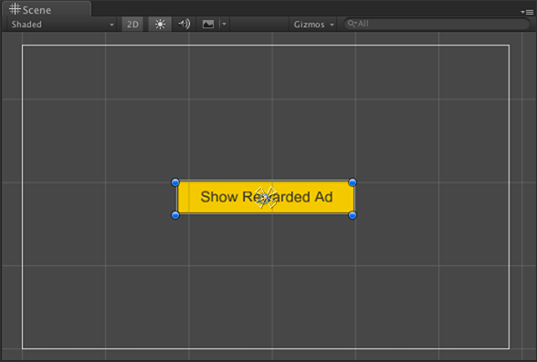
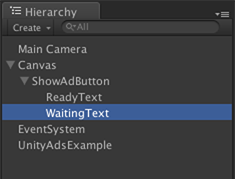
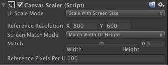
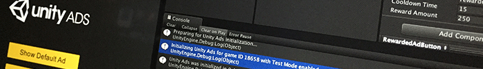

# Unity Ads Helper

The Unity Ads Helper is designed to streamline the integration of Unity Ads in Unity projects.

## Outline

* [Features](#features)
* [Getting Started](#getting-started)
* [Using UnityAdsHelper](#using-unityadshelper)
  * [Initializing Unity Ads](#initializing-unity-ads)
  * [Creating a Unity UI Button](#creating-a-unity-ui-button)
  * [Using a Unity UI Button to Show Ads](#using-a-unity-ui-button-to-show-ads)
  * [Rewarding Users for Watching Ads](#rewarding-users-for-watching-ads)
* [Example Assets](#example-assets)
* [Scripting API](#scripting-api)

## Features

* XML documentation comments for public fields and methods.  
* Settings are stored as a ScriptableObject available from the Unity Editor menu.  
* A robust `Initialize()` method that applies settings and logs when done initializing.  
* A robust `ShowAd()` method that applies options and handles the result callback.  
* Events for handling show results:  
  * `onFinishedEvent`  
  * `onSkippedEvent`  
  * `onFailedEvent`  
* A `SetGamerSID()` method for integrations using Server-to-Server Redeem Callbacks.  
* Improved handling of common integration issues:  
  * Unity Ads is only initialized once per game session.  
  * Test Mode is tied to the Development Build option in Build Settings to prevent from accidentally shipping a game with test mode still enabled.  
  * Game IDs are trimmed of white space and checked for `null` or empty values.  
  * Zone IDs are trimmed of white space and set to `null` if empty.  
  * JavaScript friendly methods.  
* Example assets you can reuse in your own project.  

[⇧ Back to top](#unity-ads-helper)

## Getting Started

**Step 1:** Download and import the [UnityAdsHelper.unitypackage](UnityAdsHelper.unitypackage?raw=true) into your Unity project.

> _**Note:** Unity Ads assets are not included. Please download and import the latest version of the [Unity Ads asset package](https://www.assetstore.unity3d.com/en/#!/content/21027) from the Asset Store._

**Step 2:** Set the **Platform** to either **iOS** or **Android**:

1. Select **File > Build Settings...** from the Unity Editor menu.  
1. Select **iOS** or **Android** from the **Platform** list.
1. Select **Switch Platform**.



**Step 3:** Enable **Development Build** to allow for the use of **Test Mode** with Unity Ads:

1. Select **File > Build Settings...** from the Unity Editor menu.  
1. Check the box next to **Development Build** to enable.

**Step 4:** Configure Unity Ads for your project:

1. Select **Edit > Unity Ads Settings** from the Unity Editor menu.  
1. Enter your **iOS Game ID** and **Android Game ID** in the fields provided.  



#### Developing with JavaScript?
Move the **UnityAdsHelper** directory into the **Standard Assets** directory.

[⇧ Back to top](#unity-ads-helper)

## Using UnityAdsHelper

A simple Unity Ads integration can be summed up in just 3 steps:

1. Initialize the Unity Ads SDK.  
1. Determine if an ad is ready.  
1. Show the ad.  

In this example, we'll show you how to initialize Unity Ads using the [UnityAdsHelper](Assets/UnityAdsHelper/Scripts/UnityAdsHelper.cs) script. Then we'll guide you through setting up a Unity UI Button that will show an ad using a method that utilizes the UnityAdsHelper script.

[⇧ Back to top](#unity-ads-helper)

### Initializing Unity Ads


The `UnityAdsHelper.Initialize()` method configures and initializes Unity Ads using the settings stored in a ScriptableObject called [UnityAdsSettings](Assets/UnityAdsHelper/Scripts/UnityAdsSettings.cs). By default, the UnityAdsSettings asset can be found in the Resources directory. You can view the UnityAdsSettings asset in the Inspector by selecting it directly, or by selecting **Edit > Unity Ads Settings** from the Unity Editor menu. Selecting this menu item will create the UnityAdsSettings asset if it does not already exist in your project.

The Test Mode option is enabled by default in Unity Ads Settings. While developing and testing your game, you should always leave Test Mode enabled. The only time it's appropriate to disable Test Mode is in cases where you are attempting to test the functionality of production ad campaigns, instead of just test ad campaigns.

> _**Note:** Development Build must be enabled in Build Settings in order to initialize Unity Ads with Test Mode enabled. This is a feature of the UnityAdsHelper script, and is intended to help prevent from accidentally releasing a final build with Test Mode still enabled._



One of the nice things about the UnityAdsHelper script is that it can be used to initialize Unity Ads in one of two ways: by calling the `UnityAdsHelper.Initialize()` method from a script within your project, or simply by adding it as a component to a new GameObject in your main scene.

For the purposes of this example, let's initialize Unity Ads by calling `UnityAdsHelper.Initialize()`.

**C# Example – UnityAdsExample.cs**  
```csharp
using UnityEngine;
using System.Collections;

public class UnityAdsExample : MonoBehaviour
{
	void Start ()
	{
		UnityAdsHelper.Initialize();
	}
}
```

**JavaScript Example – UnityAdsExample.js**  
```javascript
#pragma strict

public class UnityAdsExample extends MonoBehaviour
{
	function Start () : void
	{
		UnityAdsHelper.Initialize();
	}
}
```

Now lets add the script to your scene. Create a new GameObject in your main scene and rename it to UnityAdsExample. Then add the UnityAdsExample script to it.

The UnityAdsHelper should only be initialized once within your game, ideally when your game first starts up. In any case, the UnityAdsHelper is capable of managing its own instances, and persists across scene loads. So there will only ever be one UnityAdsHelper at a time in your game, and Unity Ads will only be initialized once.

> **Pro Tip: Designing for User Experience**
>
> One thing to consider when designing your game with Unity Ads is that you don't always have to initialize Unity Ads at the start of your game.
>
> For instance, if you've designed your game to delay the showing of ads until after the user has had time to learn the rules of gameplay and progress through a few levels, it may take a few game sessions before they reach a point where they would start seeing ads.
>
> In this case, you could hold off on initializing Unity Ads until they've crossed this threshold. Keep in mind though, Unity Ads does take several seconds to initialize and cache the assets necessary to show an ad. You should therefore allow sufficient time for Unity Ads to finish initializing before showing an ad.

[⇧ Back to top](#unity-ads-helper)

### Creating a Unity UI Button

In this section, we'll create and configure a Unity UI Button for use with this example.

> _**To learn more:** Be sure to check out the [Tutorials](http://unity3d.com/learn/tutorials/modules/beginner/ui) and [Docs](http://docs.unity3d.com/Manual/UISystem.html) for the Unity UI system._

**Step 1:** Start by creating a new Unity UI Button in your scene. Creating a new UI Button will also add a UI Canvas and EventSystem to your scene.

1. Select **GameObject > UI > Button** from the Unity Editor menu.
1. Press the T key to switch to using the Rect Transform Tool.
1. Select and drag the button to the center of the canvas.

**Step 2:** Customize the button for use with this example.

1. Rename the new UI Button to _ShowAdButton_.
1. Expand _ShowAdButton_ in the Hierarchy to view child objects.
1. Locate and select the GameObject named _Text_.
1. Rename the _Text_ GameObject to _ReadyText_.
1. Enter "Show Default Ad" into the Text field of the Text component.



**Step 3:** Create non-interactable version of the UI Text GameObject.

1. Locate and select the GameObject named _ReadyText_.
1. Select **Edit > Duplicate** to create a duplicate GameObject.
1. Rename the duplicate GameObject to _WaitingText_.
1. Enter "Waiting..." into the Text field of the the Text component.
1. Disable the Text component of the GameObject for the time being.



**Step 4:** Configure the Canvas to scale with screen size.

1. Locate and select the GameObject named _Canvas_.
1. Set the UI Scale Mode of the Canvas Scaler to Scale With Screen Size.
1. Set the Match value to 0.5 between Width and Height.



[⇧ Back to top](#unity-ads-helper)

### Using a Unity UI Button to Show Ads

With the UI all setup, let's write a script we can use to show an ad using the UI Button's OnClick UnityEvent, and make the UI Button interactable only when ads are ready.

[Placeholder]

[⇧ Back to top](#unity-ads-helper)

### Rewarding Users for Watching Ads

Typically buttons are used to show _rewarded_ ads, allowing your users the chance to opt-in before showing a non-skippable ad.

[Placeholder]

> **Pro Tip: Improving eCPM via Rewarded Ads**
>
> Rewarded ads are a way to provide users with incentive to watch video ads without skipping them in exchange for an in-game reward.

[⇧ Back to top](#unity-ads-helper)

## Example Assets



Example assets are located in [Assets/UnityAdsHelper/Examples](Assets/UnityAdsHelper/Examples/):

* UnityAdsExample.unity - Example scene file.  
* [UnityAdsExample.cs](Assets/UnityAdsHelper/Examples/Scripts/UnityAdsExample.cs) - The main example script used to initialize UnityAdsHelper.  
* [ButtonExample.cs](Assets/UnityAdsHelper/Examples/Scripts/ButtonExample.cs) - A Unity UI Button example script used to show rewarded ads.
  * Specify a zone ID or leave blank to use the default zone.  
  * Set a cooldown time in seconds to control how often users can watch rewarded ads.
  * Set a reward amount the user should receive after watching an ad without skipping.
  * Cooldowns persist across scenes and game sessions.
  * Cooldowns are independent of each other.
* [ShowAdOnLoad.cs](Assets/UnityAdsHelper/Examples/Scripts/ShowAdOnLoad.cs) - Script for showing an ad when the scene loads.
  * Specify a zone ID or leave blank to use the default zone.
  * Set a timeout duration in seconds to allow for initialization.
  * Set a timeout duration in seconds to allow ads to become ready.
  * Set a yield time in seconds for how often `isInitialized` and `IsReady()` will be evaluated.
  * The process of showing and ad on load will be canceled if either timeout is exceeded.

These assets are reusable. Feel free to modify them for use in your own project.

[⇧ Back to top](#unity-ads-helper)

## Scripting API

### UnityAdsHelper

class / Inherits from: [MonoBehaviour](http://docs.unity3d.com/ScriptReference/MonoBehaviour.html)

#### Static Properties

* ##### isSupported
  `public static bool isSupported { get; }`  

  Gets a value indicating whether Unity Ads is supported in the current Unity player.

* ##### isInitialized
  `public static bool isInitialized { get; }`  

  Gets a value indicating whether Unity Ads is initialized.

* ##### isShowing
  `public static bool isShowing { get; }`  

  Gets a value indicating whether an ad is currently showing.

* ##### gamerSID
  `public static string gamerSID { get; }`

  Gets the gamerSID, a unique identifier used with Server-to-Server Redeem Callbacks.

#### Static Methods

* ##### Initialize
  `public static void Initialize ();`  

  Configures and initializes Unity Ads using an instance of `UnityAdsSettings`. To configure Unity Ads settings, select **Edit > Unity Ads Settings** from the Unity Editor menu.

* ##### IsReady
  `public static bool IsReady ();`  
  `public static bool IsReady (string zoneId);`  

  Determines if Unity Ads is initialized and ready to show an ad using the specified `zoneId`. If the `zoneId` is not specified, or is set to `null`, the default ad placement zone will be used instead.

* ##### ShowAd
  `public static void ShowAd ();`  
  `public static void ShowAd (string zoneId);`  

  Shows an ad using the specified `zoneId`. If the `zoneId` is not specified, or is set to `null`, the default ad placement zone will be used instead.

* ##### SetGamerSID  
  `public static void SetGamerSID (string gamerSID);`

  Sets the gamer SID parameter, a unique identifier used with Server-to-Server Redeem Callbacks.

#### Static Events

* ##### onFinishedEvent
  `public static Action onFinishedEvent;`  

  Called when an ad is hidden. The ad was shown without being skipped.

* ##### onSkippedEvent
  `public static Action onSkippedEvent;`  

  Called when an ad is hidden. The ad was skipped while being shown.

* ##### onFailedEvent
  `public static Action onFailedEvent;`  

  Called when an error occurs while attempting to show an ad.

[⇧ Back to top](#unity-ads-helper)
